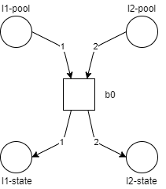
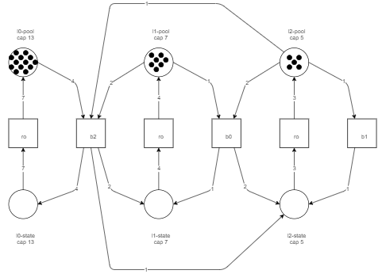

Explanation of the example configuration data JSON
========

This JSON will store all informations necessary to define the behaviour of the system.

We're not 100% sure yet how to provide it to the logic unit (initially we'll just hardcode a similar example),
but it will make the system totally adaptable to different difficulties as well as different settings (more lights, buttons, etc).

JSON structure
---

The JSON basically contains 3 arrays:
 - buttons
 - lights
 - code

The code array is just the numerical representation of the code that has to be entered.

The lights and buttons each have unique IDs which will also serve as mqtt subtopics.

The lights also have arrays of hex color values.

The buttons have an initial state (which is only for integration into a real escape room and will be active for our demonstrator),
as well as an array of actions that tells which lights will be changed by how much.

How the logic unit would handle this information
---

- The first color in the array of each light will be the initial color that this light shows when the system starts up.
- This corresponds to the numerical representation [0,0,0]
- When the button with id BUTTON_0_ID is press, the logic unit will receive a message on the according subtopic
- it will then look up the actions to take, in this case changing lights with id's LIGHT_1_ID and LIGHT_2_ID by 1 and 2
- according to this rule, it will
  - update its internally saved state to [0,1,2]
  - publish the according colors on the according subtopics
  - and check if the correct code has been entered

Options for adaptability
---

first of all, it is really easy and quick to change the different colors, code and button press behaviour of a given system.

But the idea behind the IDs is that each button and light that is installed in the escape room has it's own ID.
If you want to ad a button, maybe even without adding a light, you just add an entry in the buttons array and specify the rules for this button. Same goes for adding lights.

Checking feasibility for a given configuration
===

To be sure that a given configuration yields an actually feasible riddle (i.e. there actually exists a sequence of button presses to enter the code),
the system can be modeled as a place/transition net and the code can be checked for reachability from the initial state of the system.

For this, each light is modeled with two  places, one representing the current state of the light and one as its token pool.

For every button there will be a transition from all the token pools of the lights affected by its actions to the current states of these lights.
The weights of those transitions will be the change of the corresponding action.
Here is how that would look like for BUTTON_0_ID:

Naturaly one would think that the capacities of the lights "state" would be the number of states that this light can take, i.e. the size of its "colors" array.
But since the state of the light can role over, for example if the current state of LIGHT_0_ID is 5 (from 0,1,...,6) and BUTTON_2_ID is pressed,
the following state would be (5 + 4) mod 7 = 2, we will model a light that can take S many states to be in state s ( 0 <= s < S ), if it has s or s + S many tokens.
Therefore the capacity of each lights "state" place as well as their "pool" place will be S + (S-1).
This way button presses like the one mentioned can still be modeled, and we only need to add a "roleover" transition for each light
that takes S tokens out of its "state" place and puts them back into its "pool" place.

Since the initial state is always the first color in each lights "colors" array, the initial state of each light is 0 and all their "state" places will be empty and the "pool" places will be initially at max capacity.

All put together, this will result in the following p/t net that models the given example configuration:

